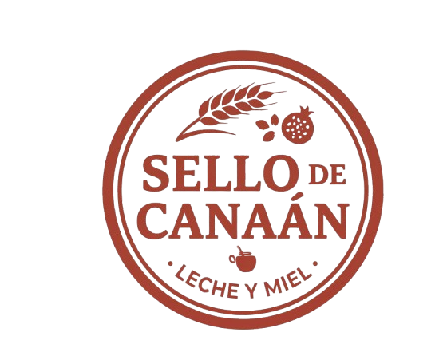

# Sello de Canaán 🥖🍕

> **Panadería y Comida Rápida Artesanal en Yuma, Carabobo.**
> Un E-commerce ligero y rápido para recepción de pedidos vía WhatsApp.



## 📌 Descripción del Proyecto

**Sello de Canaán** es una aplicación web (SPA) diseñada para un negocio local de panadería y comida rápida. Permite a los clientes de Yuma (Guigüe) explorar más de 50 productos, armar su carrito de compras con extras, calcular envíos según su zona, y enviar un pedido estructurado directamente al WhatsApp del negocio.

El proyecto está diseñado bajo principios de **Clean Code** y **Mobile-First**, garantizando tiempos de carga ultrarrápidos y una experiencia de usuario (UX) inmejorable gracias a animaciones sutiles, protección anti-spam, y conexión a bases de datos vía hojas de cálculo.

## 🚀 Tecnologías (Tech Stack)

Este proyecto no requiere un backend tradicional, lo que reduce costos a `$0` y permite un mantenimiento ultra sencillo.

- **Frontend:** HTML5 Semántico.
- **Estilos:** Vanilla CSS (Metodología BEM ligera con Paleta de Variables).
- **Interactividad:** [Alpine.js](https://alpinejs.dev/) (Framework reactivo ultraligero sin necesidad de Node/NPM).
- **Iconografía:** [Remix Icon](https://remixicon.com/) (Vía CDN).
- **Base de Datos / CMS:** [SheetDB](https://sheetdb.io/) (Sincronización en tiempo real con Google Sheets para inventario y precios).

## 📂 Estructura del Proyecto (Clean Architecture)

```text
/
├── assets/                  # Imágenes, logos y recursos gráficos estáticos.
│   ├── logo_canaan.png
│   └── fundadora.png
├── css/                     # Estilos centralizados.
│   └── styles.css           # CSS global (Variables, Layout, Componentes).
├── js/                      # Lógica de la aplicación.
│   └── app.js               # Estado con Alpine.js, carrito, seguridad y preloaders.
├── index.html               # Landing page (Historia, Reseñas, CTA).
├── canaan.html              # Catálogo / PWA interactiva con el menú y carrito.
├── 404.html                 # Página de error personalizada.
└── README.md                # Documentación del proyecto.
```

## 🛡️ Seguridad Incorporada

- **Sanitización (Anti-XSS):** Los inputs de texto (nombres, direcciones) se limpian antes de procesarse para evitar inyección de scripts a través del enlace de WhatsApp.
- **Honeypot (Anti-Spam):** Formulario oculto para cazar bots de llenado automático, evitando pedidos falsos automatizados.

## 🌍 Despliegue en GitHub Pages (Guía Rápida)

Este proyecto está 100% optimizado para ser alojado de forma gratuita en GitHub Pages.

1. **Crear el Repositorio:**
   - Sube todos los archivos y carpetas (`assets/`, `css/`, `js/`, `*.html`) a la rama `main` de un nuevo repositorio en tu cuenta de GitHub.
2. **Activar GitHub Pages:**
   - Ve a Settings (Configuración) de tu repositorio.
   - En el menú izquierdo, haz clic en **Pages**.
   - Bajo **Source** (o Build and deployment), selecciona "Deploy from a branch".
   - Elige la rama `main` y selecciona la carpeta `/ (root)`.
   - Haz clic en **Save**.
3. **¡Listo!** En unos minutos, tu sitio estará disponible en `https://[TU-USUARIO].github.io/[NOMBRE-DEL-REPO]/`.

## 🛠️ Mantenimiento (Google Sheets)

Para modificar productos, habilitar/deshabilitar el delivery, y actualizar la tasa del BCV del día, edita directamente la hoja de cálculo de Google conectada a través de SheetDB. No necesitas tocar el código fuente para el trabajo diario de la tienda.

---
Hecho con pasión y código limpio.
